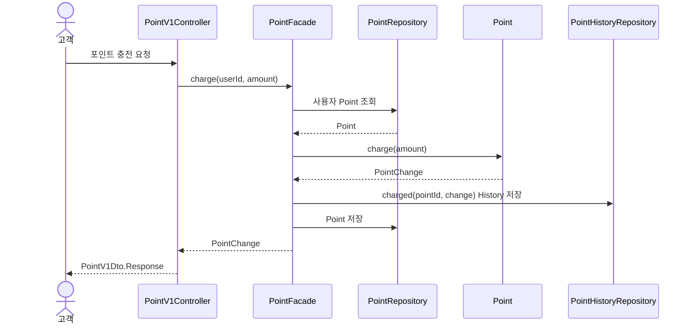
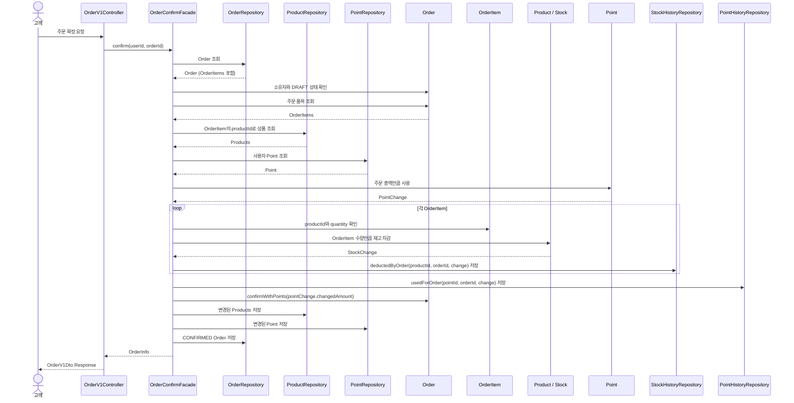

# 4. 대표 흐름

## 4.1 브랜드와 연관 상품 일괄 삭제

기존에 활성 상품이 있으면 브랜드 삭제를 거절하던 계약을, 브랜드와 연결 상품을 함께 삭제하는 계약으로 변경한다. 브랜드 삭제 시 연결된 미삭제 상품을 단일 bulk UPDATE로 Soft Delete하고, 브랜드 삭제와 하나의 트랜잭션으로 묶는다. 상품별 Entity 조회와 개별 UPDATE 반복을 피하기 위해 bulk 방식을 선택한다. 

### 4.1.1 대상과 보존 범위

상품 삭제 조건은 `brand_id = 요청한 brandId AND deleted_at IS NULL`이다. 재고가 0인 상품도 포함하며, 이미 삭제된 상품의 삭제·수정 시각과 다른 브랜드·상품은 변경하지 않는다. 연결 상품이 없는 활성 브랜드도 정상 삭제한다. 없는 브랜드와 이미 삭제된 브랜드는 상품 변경 전에 `BRAND_NOT_FOUND`로 거절한다.

상품에서는 `deleted_at`과 `updated_at`만 변경한다. 기존 재고·가격·생성 시각, Like 관계, StockHistory와 과거 Order·OrderItem의 품목·수량·단가·총액·포인트 결제 결과는 유지한다. 삭제는 재고 조정이나 거래 기록 삭제가 아니다.

### 4.1.2 호출 순서와 트랜잭션

```text
BrandAdminV1Controller.delete
  → Spring Transaction Proxy
    → BrandFacade.delete @Transactional
        1. BrandRepository.findActive(brandId)
           → 없거나 이미 삭제됐으면 BRAND_NOT_FOUND
        2. ProductRepository의 브랜드별 미삭제 상품 bulk soft delete
           → 단일 UPDATE 실행, 변경 행 수 0도 정상
        3. Brand.delete()
        4. BrandRepository.save(brand)
    → 정상 종료 시 Brand와 Product 전체 commit
    → RuntimeException 전파 또는 commit 실패 시 전체 rollback
```

`BrandFacade.delete()`를 기존 진입점과 하나의 쓰기 트랜잭션 경계로 유지한다. domain의 `ProductRepository`에 브랜드별 일괄 삭제 포트를 선언하고 infrastructure에서 bulk UPDATE를 구현한다. Facade에 JPQL·SQL을 두지 않고, 새 Domain Service나 별도 Removal Facade를 추가하지 않는다. Product별 `REQUIRES_NEW`, 단계별 독립 commit, 일부 성공 응답과 예외 삼키기는 사용하지 않는다.

개념적인 Repository 계약은 `int softDeleteAllActiveByBrandId(Long brandId, ZonedDateTime deletedAt)`이다. 실제 이름과 JPQL·native SQL 선택은 구현 단계에서 정한다. 반환값은 변경된 상품 수이며, 사전에 조회한 상품 수와 같아야 한다는 조건이나 최소 1개라는 조건은 두지 않는다.

기존 `BrandModel.delete(boolean hasActiveProducts)`의 상품 존재 여부 기반 거절 규칙은 제거하고, Brand 삭제는 상속한 `BaseEntity.delete()`를 사용한다. 단순히 부모 행동을 호출하기 위한 override는 추가하지 않는다. 삭제 거절을 위해 사용하던 `ProductRepository.existsActiveByBrandId()`와 대응하는 infrastructure·JPA Repository 메서드는 다른 사용처가 없다면 함께 제거한다. `BRAND_HAS_ACTIVE_PRODUCTS`도 변경 후 사용처가 없다면 제거하되, 부록의 과거 결정 설명은 보존한다. `BrandFixture`의 `delete(false)` 호출은 `delete()`로 변경하며, fixture는 데이터 준비 역할을 유지하고 일괄 삭제 유스케이스를 재현하지 않는다.

```sql
UPDATE product
   SET deleted_at = :deletedAt,
       updated_at = :deletedAt
 WHERE brand_id = :brandId
   AND deleted_at IS NULL;
```

상품들의 삭제·수정 시각에는 한 번 생성한 값을 사용한다. Brand는 기존 Entity 삭제 행동을 사용하며, Brand와 Product의 삭제 시각이 정확히 같아야 한다는 계약은 두지 않는다.

### 4.1.3 bulk와 영속성 컨텍스트

bulk UPDATE는 개별 `Product.delete()`, 변경 감지와 `@PreUpdate` 콜백을 거치지 않는다. 따라서 기존 `BaseEntity` 콜백에 맡기지 않고 `updated_at`도 쿼리에 명시한다. 상품별 업무 행동·검증·이벤트가 삭제에 추가되면 bulk 경로에서 이를 어떻게 보존할지 다시 검토한다.

이 흐름에서는 삭제 대상 Product Entity를 미리 조회하거나 bulk 이후 관리 객체를 계속 사용하지 않는다. Brand는 bulk 전에 조회하되 자신의 삭제 변경은 bulk 이후에 수행한다. 다만 이 순서만으로 다른 호출 경로에서 이미 적재한 Product까지 자동 동기화된다고 보장하지는 않는다.

bulk 전에 필요한 미반영 변경이 있다면 먼저 flush하고, 이후 영향을 받은 관리 객체를 다시 사용해야 한다면 재조회·refresh 또는 영속성 컨텍스트 정리를 판단한다. 무조건 `clear()`하면 아직 flush하지 않은 변경을 잃고 Brand도 분리될 수 있으므로 자동 clear를 기본 정책으로 두지 않는다. 구현 시 실제 flush 순서와 관리 객체 사용 여부를 확인한다. [Spring Data JPA 수정 쿼리 문서](https://docs.spring.io/spring-data/jpa/reference/jpa/query-methods.html#jpa.modifying-queries)

### 4.1.4 삭제 이후 사용 제한과 조회 방어

일괄 삭제된 상품은 고객·관리자 목록과 상세, 새 Like, 내 Like 목록, 새 주문, 관리자 수정·재고 변경·재삭제 대상에서 제외한다. 삭제 전에 만든 DRAFT 주문도 확정 시 상품을 다시 조회해 하나라도 삭제됐다면 포인트·재고 변경 전에 기존 `PRODUCT_NOT_FOUND`로 거절한다. 기존 자신의 Like 취소와 과거 주문 조회는 유지한다.

현재 `ProductQueryRepositoryImpl`은 상품 조회와 관련 count 쿼리에 Product와 Brand 양쪽의 `deletedAt IS NULL` 조건을 이미 적용한다. 이 조건을 유지하고 고객·관리자 상품 목록·상세와 내 Like 목록의 비노출을 검증한다. 삭제가 commit된 이후 시작된 새 조회에서, 경쟁으로 뒤늦게 등록된 상품도 삭제 Brand 조건으로 숨기는 방어 수단이다. 기존 스냅샷을 읽는 진행 중 트랜잭션에 즉시 반영된다는 보장은 하지 않는다.

조회 방어는 상품 행 자체의 삭제를 대신하지 않는다. 현재 명령용 `ProductRepository.findActive()`와 `findAllActiveByIds()`는 Product 자신의 삭제 여부만 확인하므로, `삭제 Brand + 미삭제 Product`가 남으면 화면에서 숨겨져도 상품 ID 기반 명령에서 사용할 가능성이 있다. 이번에는 이 한계를 기록하며 명령 경로의 Brand 조건 추가나 동시 등록 차단까지 구현한 것으로 간주하지 않는다.

### 4.1.5 동시성 범위와 향후 대안

이번에는 별도의 명시적 비관적·낙관적 잠금을 추가하지 않는다. 보장 범위는 한 삭제 요청에서 bulk UPDATE가 변경한 Product와 Brand 변경의 원자성이다. Brand 삭제와 상품 등록·수정·재고 변경·DRAFT 확정·Like 또는 주문 생성 간 경쟁의 정합성은 별도 확장 범위다.

MySQL InnoDB의 REPEATABLE READ를 전제로, 일반 SELECT의 MVCC 스냅샷과 UPDATE의 배타적 잠금을 구분한다. bulk UPDATE는 사용 인덱스와 검색 범위에 따라 record·next-key/gap lock으로 INSERT를 대기시킬 수 있다. 그러나 잠금 해제 후 INSERT가 진행될 수 있으므로, 벌크 잠금 자체가 삭제된 Brand의 상품 등록을 거부하는 업무 규칙은 아니다. 실제 격리 수준과 실행계획은 구현·실험 시 확인한다. [MySQL 잠금 문서](https://dev.mysql.com/doc/refman/8.0/en/innodb-locks-set.html)

```text
TX B: 활성 Brand 확인 후 상품 등록 준비
TX A: Product bulk 삭제, Brand 삭제
TX B: INSERT 시도 → 잠금과 겹치면 대기
TX A: commit 및 잠금 해제
TX B: Brand를 다시 검사하지 않고 INSERT·commit → 미삭제 상품 잔존 가능
```

이 경쟁 자체를 팬텀 리드로 부르지 않는다. 같은 조건의 반복 조회 결과가 달라지는 읽기 현상과, 삭제·등록의 업무 규칙이 엇갈리는 문제를 구분한다. RR의 일반 SELECT와 UPDATE가 대상으로 삼는 데이터도 반드시 같지는 않다. [MySQL 일관 읽기 문서](https://dev.mysql.com/doc/refman/8.0/en/innodb-consistent-read.html)

다음 두 대안은 검토 후보로만 남기며 이번에는 구현하지 않는다.

- 사후 보정 배치: 삭제 Brand 아래의 미삭제 Product를 찾아 삭제한다. 보정 전 사용 가능성을 막지는 못하며, 배치를 구현하기 전에는 자동 복구도 보장하지 않는다.
- 공통 Brand 잠금: 상품 등록과 Brand 삭제 양쪽이 같은 Brand 행을 `FOR UPDATE`로 조회하고, 잠금을 획득한 뒤 최신 삭제 여부를 검사한다. 기존 Product 행만 잠그거나 삭제 경로만 Brand를 잠그는 것으로 새로운 상품 INSERT를 업무적으로 차단했다고 보장하지 않는다.

### 4.1.6 인덱스와 설계 재검토 기준

이번 구현에 `product(brand_id)` 단독 인덱스를 추가한다. 목적은 bulk UPDATE에서 해당 Brand의 상품을 찾는 탐색 비용을 줄이는 것이다. `brand_id`로 대상을 찾고 `deleted_at IS NULL`을 추가 검사한다. 인덱스는 `ProductModel`의 `@Table(indexes = …)`에 `@Index(columnList = "brand_id")`로 선언하고, local·test의 기존 `ddl-auto: create` 설정에 따른 스키마 생성으로 반영한다. 새 마이그레이션 체계는 도입하지 않는다. 어노테이션 선언만으로 스키마 생성을 하지 않는 기존 DB까지 변경된다고 보장하지 않으며, 동일한 인덱스를 중복 생성하지 않는다. 실제 사용 여부는 실행계획으로 확인한다.

`(brand_id, deleted_at)` 복합 인덱스는 필수가 아니다. 이미 삭제된 상품이 많이 누적되어 불필요한 탐색이 커지면 비교한다. 대부분 미삭제라면 탐색 감소 이점이 작을 수 있고, 복합 인덱스의 공간 및 삭제 시 인덱스 갱신 비용도 고려한다.

이번 실습에서는 성능 측정을 필수 검증 범위에 포함하지 않는다. commit을 포함한 삭제 API 응답시간 2초 이내, 3초 초과의 반복은 향후 설계 재검토를 위한 잠정 참고 기준으로만 둔다. 측정으로 도출한 수치나 성능 보장이 아니며, 운영 요구와 향후 측정 결과에 따라 조정한다. API timeout·거절 조건이나 자동 비동기 전환 규칙으로 사용하지 않는다.

- 응답 지연이 반복되거나 다른 요청의 잠금 대기가 커지면 실행계획·탐색량·인덱스·잠금 대기를 먼저 확인한다.
- 1,000개 같은 임의의 상품 수 API 상한은 추가하지 않는다. 향후 성능 측정 시 상품 수·전체 테이블 규모·동시 요청·실행 환경을 함께 기록한다.
- 개선 후에도 동기 처리가 적절하지 않으면 비동기 또는 분할 배치를 검토한다. 비동기는 DB 작업 자체를 줄이지 않으며, 분할 commit은 전체 원자성 계약을 바꾸므로 삭제 진행 상태·응답 의미·재시도와 실패 처리까지 별도 설계한다.

### 4.1.7 검증 계획

실습의 핵심 검증은 정상 일괄 삭제와 중간 실패 시 전체 rollback이다. 기존 검증은 새 계약에서도 유효한 경우에만 유지한다. 브랜드 이름 검증·등록·조회·수정, 연결 상품 없는 Brand 삭제, 연결 상품이 모두 삭제된 Brand 삭제, 다른 Brand·Product 보존, 없는·이미 삭제된 Brand 거절은 유지한다. `활성 Product가 있으면 Brand 삭제 거절`처럼 사라진 규칙을 검증하는 도메인·통합·API 테스트는 제거한다. 기존 테스트마다 다른 테스트를 대응시켜 대체할 필요는 없으며, 새 일괄 삭제와 rollback 계약은 별도로 검증한다. 이는 폐기된 규칙의 검증을 정리하는 것이며, 새 설계에서도 유효한 테스트나 lint·ArchUnit 규칙을 완화하는 것은 아니다.

정상 일괄 삭제 테스트에서는 재고 0을 포함한 연결 미삭제 Product 전체와 Brand의 삭제, 연결 상품 없는 Brand 성공, 없는·삭제된 Brand 오류, 이미 삭제된 상품의 삭제·수정 시각 보존, 다른 Brand·Product와 과거 주문 보존을 확인한다.

rollback 통합 테스트는 Brand와 연결 Product 2개(하나는 재고 0), 다른 Brand의 Product와 과거 주문을 준비하고 먼저 commit한다. 테스트 전체를 하나의 부모 트랜잭션으로 감싸지 않으며, 실제 Spring bean의 `BrandFacade.delete()`를 프록시를 통해 호출해 유스케이스 트랜잭션이 시작·종료되게 한다.

rollback 테스트는 실제 MySQL에서 Product bulk UPDATE를 실행한 뒤, 테스트 구성의 다음 Brand 저장 경계에서 RuntimeException을 유발한다. 전체 Repository를 mock하지 않고, bulk 쿼리를 생략하거나 실제 SQL 실행 전에 실패시키지 않는다. 운영 코드에 테스트용 실패 분기·sleep·barrier를 넣지 않는다.

Facade 트랜잭션이 끝난 뒤 새로운 트랜잭션·영속성 컨텍스트에서 Brand와 모든 대상 Product의 삭제·수정 시각 등 상태가 작업 전과 같은지 확인한다. 활성 데이터 조회만으로 판단하지 않고 삭제 행도 조회할 수 있는 경로로 변경 전후 상태를 비교한다. 다른 대상과 과거 주문도 유지되고 예외가 호출자에게 전파되어야 한다. 단순 `save()` 호출 횟수나 같은 관리 객체의 값은 rollback 증거로 사용하지 않는다.

HTTP 테스트와 중간 실패 rollback 통합 테스트의 역할은 구분한다. HTTP에서는 관리자 삭제 성공의 `200`과 `data: null`, 없는·이미 삭제된 Brand의 `404 BRAND_NOT_FOUND`, 일반 사용자·익명 요청의 `403`을 실제 DB 결과와 연결해 확인한다. 성공 시 대상 전체가 삭제되고, 거절 시에는 Brand·Product가 변경되지 않아야 한다. 관리자 변경 요청과 역할 거절 테스트에는 기존 정책에 따라 유효한 CSRF 입력을 보낸다. 실패 주입에 의한 전체 rollback은 위 실제 MySQL Facade 통합 테스트로 증명하며, HTTP 계층에서 같은 실패 주입을 반복하는 것을 필수로 두지 않는다.

변경 영향에 대한 회귀 테스트로 삭제 이후 조회·사용 제한, 기존 Like 취소와 DRAFT 확정 거절을 검증한다. 영향받는 브랜드·상품·포인트·주문 테스트와 기존 lint(Checkstyle)·ArchUnit도 실행한다.

브랜드 삭제와 상품 등록의 동시 실행 테스트는 선택 확장이다. 4.1.5의 사후 보정 배치와 공통 Brand 잠금은 향후 대안으로 유지하되, 이번에 구현하거나 검증한 것으로 간주하지 않는다.

## 4.2 포인트 충전

포인트 충전은 `PointFacade`가 유스케이스 순서와 트랜잭션을 관리한다. PointHistory는 Point 변경에 부속된 감사 기록으로 같은 트랜잭션에서 저장한다.

공통 요청자 식별 단계에서 `UserFacade`가 테스트 DB에 준비된 User의 존재를 확인한 뒤, PointFacade는 해당 User와 함께 fixture로 준비된 Point를 조회한다. 존재하는 User에게 Point가 없는 경우에는 최초 충전으로 간주해 새로 생성하지 않고 비정상적인 데이터 상태로 처리한다. 구체적인 오류 응답은 [5장](./05-api-contract.md#5-api-계약과-주요-규칙)의 API 계약에서 정한다.



*그림 6. 포인트 충전 객체 협력 흐름*

Point는 충전 금액이 양수인지 확인하고 잔액을 증가시킨 뒤 변경 전후 잔액과 충전액을 담은 PointChange를 반환한다. PointFacade는 `PointHistoryModel.charged(pointId, change)`로 충전 이력을 생성해 저장하고 domain 타입인 PointChange를 Controller에 반환한다. Controller는 충전 후 잔액을 `PointV1Dto.Response`로 변환한다. fixture에서 Point에 설정한 초기 잔액 0은 충전이나 사용에 따른 변경이 아니므로 PointHistory를 생성하지 않는다. Point 변경과 History 저장은 같은 트랜잭션에서 처리하며, 입력이나 저장에 실패하면 잔액과 History는 모두 변경되지 않는다.

## 4.3 주문 확정

포인트 충전 후 주문 확정을 대표 흐름으로 선택한다. 이 흐름은 모든 API 유스케이스를 시작하고 트랜잭션을 관리하는 Facade, Entity가 지키는 상태 규칙, 주문 확정 시 함께 변경되어야 하는 상태를 보여 준다.

주문 생성은 이 흐름보다 먼저 완료되어 있으며, 고객이 소유한 `DRAFT` 주문이 존재한다고 가정한다. 포인트 충전과 주문 확정은 서로 다른 API 요청이자 별도의 트랜잭션이다. 따라서 주문 확정이 실패하더라도 앞서 완료된 포인트 충전 결과는 유지된다.

주문 확정은 [5.1](./05-api-contract.md#51-공통-계약과-입력-정책)의 전액 포인트 결제 규칙을 따른다. 주문 총액 전부를 포인트로 결제하며, 주문 확정 요청에서 사용할 포인트를 별도로 입력하지 않는다. 따라서 포인트 사용액과 결제액은 주문 총액과 같으며, 고객의 포인트 잔액이 주문 총액보다 적으면 확정을 거절한다.

주문 생성은 `OrderFacade`가 Product 조회, 요청한 모든 Product의 존재·활성 상태 확인, Order 저장과 트랜잭션을 담당하고, 순수 Domain Service인 `OrderService`가 중복 품목 병합과 준비된 상품의 주문 시점 가격으로 초안 Order를 만드는 규칙을 담당한다. 주문 확정은 별도 처리 흐름과 변경 범위를 가진 `OrderConfirmFacade`가 Order, Product·Stock, Point의 변경 순서와 전체 트랜잭션을 관리한다. 두 Facade는 서로 호출하지 않고 필요한 Repository와 도메인 객체에 직접 의존한다.



*그림 7. 주문 확정 객체 협력 흐름*

OrderRepository는 Order와 Order가 소유한 OrderItem을 함께 복원한다. 구체적인 JPA 로딩 방식은 구현 단계에서 결정한다. 재고 차감에 사용하는 상품과 수량은 확정 요청에서 다시 받지 않고, 저장된 OrderItem의 `productId`와 `quantity`를 기준으로 한다.

Order는 요청자가 주문 소유자인지와 현재 상태가 `DRAFT`인지 확인한다. Point는 잔액이 주문 총액 이상인지 확인한 뒤 주문 총액을 먼저 차감하고 PointChange를 반환한다. 이후 각 OrderItem에 대응하는 Product와 Stock이 상품의 주문 가능 여부와 재고를 확인하고 수량을 차감한 뒤 StockChange를 반환한다. OrderConfirmFacade는 각 변경 결과에 주문 식별자를 더해 `PointHistoryModel.usedForOrder(pointId, orderId, change)`와 `StockHistoryModel.deductedByOrder(productId, orderId, change)`로 이력을 생성하고 저장한다. Order는 PointChange의 포인트 사용액이 주문 총액과 같은지 확인하고, 같은 금전적 가치를 결제액으로 기록한 뒤 `CONFIRMED`로 전이한다. OrderConfirmFacade는 트랜잭션 안에서 확정된 주문·품목·결제 정보를 `OrderInfo`로 구성해 반환하고, Controller는 이를 `OrderV1Dto.Response`로 변환한다. 이 상태 전이가 주문 확정과 결제의 성공 결과를 나타낸다. Point와 Stock의 처리 순서를 선택한 근거와 비용은 [부록 A.3](./appendix-decisions.md#a3-주문-확정의-포인트재고-처리-순서)에서 비교한다.

주문이 없거나 요청자가 소유자가 아닌 경우, 주문이 이미 확정된 경우, 상품이 없거나 삭제된 경우, 재고 또는 포인트가 부족한 경우에는 확정을 거절한다. 주문 확정 중 하나의 검증이나 저장이라도 실패하면 재고·포인트·History·주문 상태 변경을 모두 롤백한다. 앞서 별도 트랜잭션으로 완료된 포인트 충전은 이 롤백에 포함되지 않는다.

이번 구현은 단일 요청 안에서의 트랜잭션 정합성까지만 보장한다. 동일 주문의 동시 확정이나 동일 상품 재고의 동시 차감처럼 여러 요청이 동시에 실행되는 상황의 정합성 제어는 현재 범위에 포함하지 않으며, 관련 위험과 향후 대안은 [부록 A.3](./appendix-decisions.md#a3-주문-확정의-포인트재고-처리-순서)에서 다룬다.
