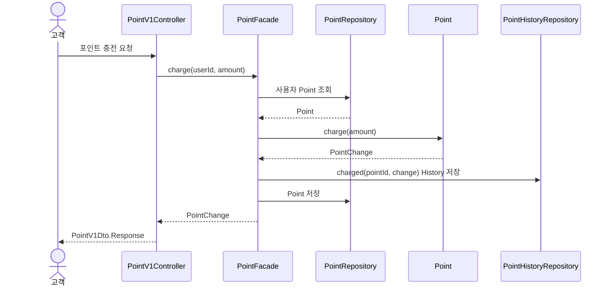
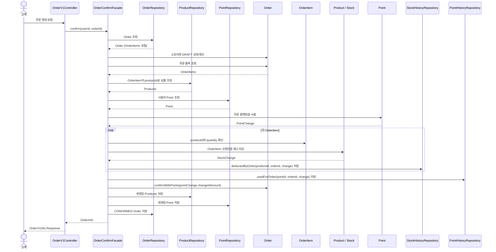

# 4. 대표 흐름

## 4.1 브랜드와 연관 상품 일괄 삭제

## 4.2 포인트 충전

포인트 충전은 `PointFacade`가 유스케이스 순서와 트랜잭션을 관리한다. PointHistory는 Point 변경에 부속된 감사 기록으로 같은 트랜잭션에서 저장한다.

공통 요청자 식별 단계에서 `UserFacade`가 테스트 DB에 준비된 User의 존재를 확인한 뒤, PointFacade는 해당 User와 함께 fixture로 준비된 Point를 조회한다. 존재하는 User에게 Point가 없는 경우에는 최초 충전으로 간주해 새로 생성하지 않고 비정상적인 데이터 상태로 처리한다. 구체적인 오류 응답은 [5장](./05-api-contract.md#5-api-계약과-주요-규칙)의 API 계약에서 정한다.

*그림 6. 포인트 충전 객체 협력 흐름*

Point는 충전 금액이 양수인지 확인하고 잔액을 증가시킨 뒤 변경 전후 잔액과 충전액을 담은 PointChange를 반환한다. PointFacade는 `PointHistoryModel.charged(pointId, change)`로 충전 이력을 생성해 저장하고 domain 타입인 PointChange를 Controller에 반환한다. Controller는 충전 후 잔액을 `PointV1Dto.Response`로 변환한다. fixture에서 Point에 설정한 초기 잔액 0은 충전이나 사용에 따른 변경이 아니므로 PointHistory를 생성하지 않는다. Point 변경과 History 저장은 같은 트랜잭션에서 처리하며, 입력이나 저장에 실패하면 잔액과 History는 모두 변경되지 않는다.

## 4.3 주문 확정

포인트 충전 후 주문 확정을 대표 흐름으로 선택한다. 이 흐름은 모든 API 유스케이스를 시작하고 트랜잭션을 관리하는 Facade, Entity가 지키는 상태 규칙, 주문 확정 시 함께 변경되어야 하는 상태를 보여 준다.

주문 생성은 이 흐름보다 먼저 완료되어 있으며, 고객이 소유한 `DRAFT` 주문이 존재한다고 가정한다. 포인트 충전과 주문 확정은 서로 다른 API 요청이자 별도의 트랜잭션이다. 따라서 주문 확정이 실패하더라도 앞서 완료된 포인트 충전 결과는 유지된다.

주문 확정은 [5.1](./05-api-contract.md#51-공통-계약과-입력-정책)의 전액 포인트 결제 규칙을 따른다. 주문 총액 전부를 포인트로 결제하며, 주문 확정 요청에서 사용할 포인트를 별도로 입력하지 않는다. 따라서 포인트 사용액과 결제액은 주문 총액과 같으며, 고객의 포인트 잔액이 주문 총액보다 적으면 확정을 거절한다.

주문 생성은 `OrderFacade`가 Product 조회, 요청한 모든 Product의 존재·활성 상태 확인, Order 저장과 트랜잭션을 담당하고, 순수 Domain Service인 `OrderService`가 중복 품목 병합과 준비된 상품의 주문 시점 가격으로 초안 Order를 만드는 규칙을 담당한다. 주문 확정은 별도 처리 흐름과 변경 범위를 가진 `OrderConfirmFacade`가 Order, Product·Stock, Point의 변경 순서와 전체 트랜잭션을 관리한다. 두 Facade는 서로 호출하지 않고 필요한 Repository와 도메인 객체에 직접 의존한다.

*그림 7. 주문 확정 객체 협력 흐름*

OrderRepository는 Order와 Order가 소유한 OrderItem을 함께 복원한다. 구체적인 JPA 로딩 방식은 구현 단계에서 결정한다. 재고 차감에 사용하는 상품과 수량은 확정 요청에서 다시 받지 않고, 저장된 OrderItem의 `productId`와 `quantity`를 기준으로 한다.

Order는 요청자가 주문 소유자인지와 현재 상태가 `DRAFT`인지 확인한다. Point는 잔액이 주문 총액 이상인지 확인한 뒤 주문 총액을 먼저 차감하고 PointChange를 반환한다. 이후 각 OrderItem에 대응하는 Product와 Stock이 상품의 주문 가능 여부와 재고를 확인하고 수량을 차감한 뒤 StockChange를 반환한다. OrderConfirmFacade는 각 변경 결과에 주문 식별자를 더해 `PointHistoryModel.usedForOrder(pointId, orderId, change)`와 `StockHistoryModel.deductedByOrder(productId, orderId, change)`로 이력을 생성하고 저장한다. Order는 PointChange의 포인트 사용액이 주문 총액과 같은지 확인하고, 같은 금전적 가치를 결제액으로 기록한 뒤 `CONFIRMED`로 전이한다. OrderConfirmFacade는 트랜잭션 안에서 확정된 주문·품목·결제 정보를 `OrderInfo`로 구성해 반환하고, Controller는 이를 `OrderV1Dto.Response`로 변환한다. 이 상태 전이가 주문 확정과 결제의 성공 결과를 나타낸다. Point와 Stock의 처리 순서를 선택한 근거와 비용은 [부록 A.3](./appendix-decisions.md#a3-주문-확정의-포인트재고-처리-순서)에서 비교한다.

주문이 없거나 요청자가 소유자가 아닌 경우, 주문이 이미 확정된 경우, 상품이 없거나 삭제된 경우, 재고 또는 포인트가 부족한 경우에는 확정을 거절한다. 주문 확정 중 하나의 검증이나 저장이라도 실패하면 재고·포인트·History·주문 상태 변경을 모두 롤백한다. 앞서 별도 트랜잭션으로 완료된 포인트 충전은 이 롤백에 포함되지 않는다.

이번 구현은 단일 요청 안에서의 트랜잭션 정합성까지만 보장한다. 동일 주문의 동시 확정이나 동일 상품 재고의 동시 차감처럼 여러 요청이 동시에 실행되는 상황의 정합성 제어는 현재 범위에 포함하지 않으며, 관련 위험과 향후 대안은 [부록 A.3](./appendix-decisions.md#a3-주문-확정의-포인트재고-처리-순서)에서 다룬다.
