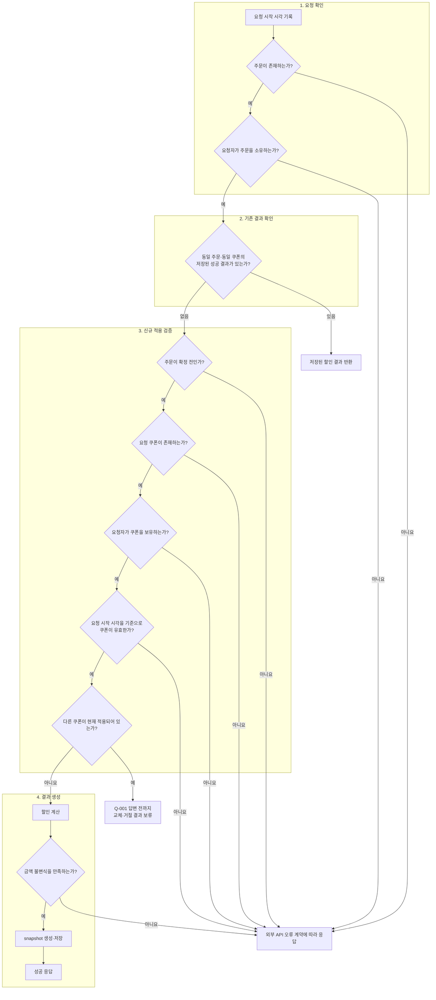

# 쿠폰 설계

이 문서는 쿠폰 적용 기능의 테스트와 제품 코드를 작성할 구현자가 별도의 구두 설명 없이 사용할 수 있는 설계 기록이다. 현재 확인된 요구사항과 주어진 규칙만을 바탕으로 쿠폰 적용 흐름에 필요한 최소 계약을 정의하며, 추가 결정이 필요한 제품 정책은 질문으로 분리하여 현재 설계에 반영하지 않는다.

---

## 기준 문장

> “구매자는 주문 확정 전에 보유 쿠폰을 적용할 수 있고, 확정된 할인 금액은 나중에 바뀌지 않아야 한다.”

- **출처:** 「1주차 실습 · 모호한 쿠폰 요구를 구현 가능한 설계로 바꾸기」의 ‘기준 문장’과 「1주차 · AI와 함께 모호한 요구를 구현 가능한 설계로 좁히기」의 ‘주문 흐름에서 먼저 지킬 약속’
- **해석 원칙:** 문장에 직접 적힌 구매자, 확정 전 적용, 확정 금액 보존만 제품 약속으로 취급한다. 문장에 없는 내용은 추론하지 않는다.

---

## 확인된 요구사항

### 확인된 사실 2개

| ID | 확인된 사실 | 설계에 반영할 내용 |
|---|---|---|
| **FACT-001** | 구매자는 주문 확정 전에 자신이 보유한 쿠폰을 자신의 주문에 적용할 수 있다. | 주문 소유권, 쿠폰 보유 여부, 주문 확정 여부를 성공 전에 확인해야 한다. |
| **FACT-002** | 성공하여 확정된 할인 금액은 이후 쿠폰 정책이 바뀌어도 변경되지 않는다. | 확정 결과를 조회 시점에 재계산하지 않고 저장된 결과로 반환해야 한다. |

### 실습 조건 4개

| ID | 규칙 |
|---|---|
| **COND-001** | 한 주문에는 쿠폰 한 장만 적용한다. |
| **COND-002** | finalAmount = originalAmount - discountAmount이고 0 ≤ discountAmount ≤ originalAmount이다. |
| **COND-003** | 같은 주문·쿠폰 재요청은 저장된 결과를 돌려주고 효과를 늘리지 않는다. |
| **COND-004** | 쿠폰 만료 여부는 요청 시작 시각으로 판단한다. |

## 제품 담당자에게 확인할 질문

| 질문 ID | 제품 담당자에게 확인할 질문 | 현재 자료만으로 결정할 수 없는 이유 | 답에 따라 달라지는 사용자 응답·저장 데이터·권한 | 답변 전 처리 |
|---|---|---|---|---|
| **Q-001** | 구매자가 보유한 쿠폰 A가 적용된 주문에 자신이 보유한 쿠폰 B를 요청하면 교체하는가, 거절하는가? | COND-001은 성공 상태에 한 장만 허용할 뿐 교체·거절을 정하지 않음 | **사용자 응답:** 새 쿠폰 적용 성공 또는 기존 쿠폰 유지와 거절 안내 **저장 데이터:** 기존·신규 할인 결과와 쿠폰 상태 | **보류** |
| **Q-002** | 쿠폰 할인 금액은 어떤 금액을 기준으로 어떤 방식과 규칙에 따라 결정하는가? | COND-002는 할인 금액의 범위와 최종 금액의 관계만 정하고 originalAmount의 구성과 할인 금액의 계산 방식은 정하지 않음 | **사용자 응답:** 반환되는 원금·할인 금액·최종 금액 **저장 데이터:** originalAmount의 구성, 쿠폰 계산 규칙과 확정 금액 | **보류** |
| **Q-003** | 주문 취소·환불 시 쿠폰을 복구하는가? 복구한다면 어느 상태로 복구하는가? | 발제 자료가 실제 제품에서는 환불·정산과 결합될 수 있다고만 설명 | **사용자 응답:** 취소·환불 후 쿠폰 재사용 가능 여부와 복구 안내 **저장 데이터:** 쿠폰 상태와 복구 이력 | **보류** |
| **Q-004** | 쿠폰의 사용 상태 전이 시점과 만료 경계를 어떻게 정의할 것인가? | 기준 문장은 쿠폰 상태 전이 시점을 정하지 않고 COND-004는 만료 판단에 사용할 시각만 정할 뿐 두 시각이 같은 경우의 유효 여부는 정하지 않음 | **사용자 응답:** 쿠폰 적용 성공·실패와 만료 안내 **저장 데이터:** 쿠폰 상태, 상태 전이 시점과 만료 시각의 의미 | **보류** |
| **Q-005** | 쿠폰의 주문 간 재사용과 세 가지 동시 요청 유형의 처리 결과를 어떻게 정할 것인가? | COND-001은 주문당 쿠폰 수만 정하고 COND-003은 저장된 결과가 있는 동일 주문·쿠폰 재요청만 정하므로, 동일 주문·동일 쿠폰, 동일 주문·서로 다른 쿠폰, 서로 다른 주문·동일 쿠폰의 동시 요청 결과는 알 수 없음 | **사용자 응답:** 동시 요청의 성공·실패 또는 재시도 안내 **저장 데이터:** 생성되는 할인 결과 수, 쿠폰 사용 횟수와 주문 연결 | **보류** |

1. 제품 담당자의 답변이 필요한 정책은 현재 설계에 반영하지 않으며, 답변과 근거를 확인한 뒤 반영한다.
2. 부록의 선택지는 답변을 돕기 위한 참고 자료이며 특정 선택을 요구하지 않는다.
3. 도구의 제안을 제품 정책으로 채택한 항목은 없다.

## 불변식과 반례

| 규칙 ID | 규칙 | 출처 구분 | 반례 | 기대 결과 | 책임 후보 |
|---|---|---|---|---|---|
| **INV-001** | 구매자는 자신이 소유한 주문만 변경할 수 있다. | 제품 사실: FACT-001 | 주문 소유자가 아닌 다른 구매자가 해당 주문에 쿠폰 적용을 요청한다. | 요청을 거절하고 주문과 쿠폰의 상태를 변경하지 않으며, 요청자에게 주문의 존재 여부를 공개하지 않는다. | 사용자 식별·주문 접근 검증 |
| **INV-002** | 주문 확정 전의 한 주문에는 구매자가 보유한 쿠폰을 최대 한 장만 적용할 수 있다. | 제품 사실: FACT-001 + 실습 조건: COND-001 | 구매자가 보유하지 않은 쿠폰 ID로 요청하거나, 확정 주문에 적용하거나, 보유 쿠폰 A가 적용된 주문에 보유 쿠폰 B 요청 | 미보유 쿠폰, 확정 주문 또는 한 주문에 두 쿠폰이 적용된 성공 상태를 만들지 않는다. 보유 쿠폰 B의 교체·거절 결과는 Q-001로 보류한다. | 주문 상태 전이 + 쿠폰 보유 판정 |
| **INV-003** | finalAmount = originalAmount - discountAmount이고 0 ≤ discountAmount ≤ originalAmount이다. | 실습 조건: COND-002 | 원금 10,000원에 할인액 12,000원을 적용하여 최종 금액이 -2,000원으로 계산된다. | 쿠폰 적용을 성공 처리하지 않으며, 최종 금액이 음수인 할인 결과를 주문에 저장하지 않는다. | 주문 금액 계산·검증 |
| **INV-004** | 주문 확정 뒤에는 쿠폰 정책이 변경되더라도 저장된 할인 금액과 최종 금액은 바뀌지 않는다. | 제품 사실: FACT-002 | 10% 할인 확정 후 정책을 20%로 변경하고 재조회 | 저장된 할인 금액과 최종 금액을 그대로 반환 | 확정 할인 snapshot |
| **INV-005** | 같은 주문·쿠폰 재요청은 저장된 할인 결과를 그대로 반환하며, 할인을 중복 적용하지 않는다. | 실습 조건: COND-003 | 주문 확정 전 10% 할인으로 쿠폰 적용에 성공한 뒤 쿠폰 정책이 20%로 변경되고, 같은 주문·쿠폰을 다시 요청했을 때 20%로 재계산한 결과를 반환하거나 기존 할인 결과를 덮어쓴다. | 첫 요청에서 저장된 할인 결과를 그대로 반환하며, 변경된 쿠폰 정책으로 재계산하거나 할인 효과를 추가하지 않는다. | 기존 성공 결과 조회·멱등 처리 |
| **INV-006** | 쿠폰 만료 여부는 요청 시작 시각 하나를 기준으로 판단한다. | 실습 조건: COND-004 | 만료 시각이 15:00인 쿠폰의 적용 요청이 14:59:59에 시작됐지만, 쿠폰을 조회한 시각이 15:00:01이라는 이유로 만료된 쿠폰으로 판단한다. | 쿠폰 조회 시각이 아니라 요청 시작 시각을 기준으로 판단하며, 처리 도중 기준 시각을 바꾸지 않는다. | 요청 시작 시각 캡처 + 쿠폰 사용 가능 판정 |

---

## 설계 범위

아래 범위는 문서에서 언급하는 주제가 아니라 현재 확정된 설계 계약에 반영하는 범위를 말한다.

### 포함

- 구매자가 자신의 주문에 보유 쿠폰을 적용하는 장면
- 주문 확정 전 할인 적용
- 주문 한 건에 쿠폰 한 장
- 할인 금액의 관계·범위 검증과 확정 결과 보존
- 동일 주문·쿠폰 재요청
- 요청 시작 시각 기준 만료 판단
- 외부 API와 오류 의미
- 불변식을 맡을 책임 후보와 내부 경계
- 오류 타입 체계 대안 비교(선택 심화)

### 제외

- 쿠폰 적용 제품 코드와 내부 클래스 구현
- 데이터베이스 테이블 구조 확정
- 복수 쿠폰 적용과 운영자 강제 할인
- 취소·환불·정산 기능 구현
- 제품 담당자의 답변 전인 Q-001~Q-005의 세부 정책 확정
- 쿠폰 적용 후 주문 확정 전 주문 금액 변경에 따른 쿠폰 재계산 처리

## 주문에 쿠폰 적용 유즈케이스

| 항목 | 계약 |
|---|---|
| 주 사용자 | 구매자 |
| 시작 조건 | 구매자 소유 주문이며 아직 확정되지 않았고 보유 쿠폰을 선택함 |
| 시작 사건 | orderId와 couponId로 할인 적용 요청 |
| 성공 결과 | 할인 결과 기록과 주문 원금·할인 금액·최종 금액 반환 |
| 실패 결과 | 주문 없음 또는 접근 불가, 주문 확정, 쿠폰 없음 또는 구매자 미보유·사용 불가, 금액 불변식 위반 |
| 종료 조건 | 성공한 결과가 이후 쿠폰 정책 변경이나 동일 요청에도 바뀌지 않음 |

---

## 외부 API 계약

### 쿠폰 적용 API

| 항목 | 채택한 기술 설계 | 근거 |
|---|---|---|
| Method | **POST** | 실습 자료의 W2 기본 장면 |
| Path | **/api/v1/orders/{orderId}/discount** | 실습 자료의 W2 기본 장면 |
| 사용자 식별 | **X-USER-ID 헤더** | 발제의 INV-001 반례 |
| Request | **couponId 한 개** | 실습 자료의 W2 기본 장면, COND-001 |
| Success status | **200 OK** | 최초 적용과 재요청 모두 주문의 할인 결과를 반환하며, 같은 주문·쿠폰 재요청은 저장된 결과를 돌려주고 효과를 늘리지 않는다(INV-005). 별도 할인 자원 생성 요구가 없는 W2 기본 장면이다. |
| Success data | **orderId, originalAmount, discountAmount, finalAmount** | 실습 자료의 W2 기본 장면 |
| 공통 응답 형식 | **ApiResponse의 meta와 data** | 기존 Example API 관찰 결과 |

요청 예시:

~~~http
POST /api/v1/orders/100/discount
X-USER-ID: 10
Content-Type: application/json
~~~

~~~json
{
  "couponId": 20
}
~~~

성공 응답 예시:

~~~json
{
  "meta": {
    "result": "SUCCESS",
    "errorCode": null,
    "message": null
  },
  "data": {
    "orderId": 100,
    "originalAmount": 10000,
    "discountAmount": 1000,
    "finalAmount": 9000
  }
}
~~~

예시 숫자는 API 모양을 설명하기 위한 값이며 할인율이나 제품 정책을 확정하지 않는다.

#### 성공 상태 코드 결정

- **선택:** 첫 적용과 동일 주문·쿠폰 재요청 모두 200 OK
- **버린 대안:** 첫 적용은 201 Created, 재요청은 200 OK
- **이유:** 실습 자료는 별도 할인 자원의 생성 위치를 요구하지 않고 주문에 적용된 결과를 반환하도록 한다. INV-005는 동일 요청에 저장된 결과를 반환하도록 하므로 최초와 재요청의 외부 결과를 불필요하게 나누지 않는다.

### 네 가지 입력 관찰 결과

기존 Example API가 정상 요청과 서로 다른 실패를 외부에 어떻게 표현하는지 `ContractClassificationTest`를 통해 관찰했다.

| 입력 | HTTP 상태 | `meta.result` | `meta.errorCode` | `data` | 의미 |
|---|---:|---|---|---|---|
| 존재하는 숫자 ID | `200 OK` | `SUCCESS` | `null` | 있음 | 정상 조회 |
| 숫자가 아닌 ID `abc` | `400 BAD_REQUEST` | `FAIL` | `Bad Request` | `null` | 요청 문법 오류 |
| 존재하지 않는 숫자 ID `-1` | `404 NOT_FOUND` | `FAIL` | `Not Found` | `null` | 대상 자원 없음 |
| 매핑되지 않은 URL | `404 NOT_FOUND` | `FAIL` | `Not Found` | `null` | 요청 처리기 없음 |

관찰 결과, 존재하지 않는 자원과 매핑되지 않은 URL은 현재 외부 응답만으로는 동일하게 `404 / Not Found`로 표현된다. 반면 숫자가 아닌 ID는 요청 문법 오류로 분류되어 `400 / Bad Request`로 구분된다. 이 결과는 주문 할인 제품 정책이 아니라 공통 응답 형식과 현재 오류 표현의 기준선이다.

### 오류 의미와 요청자의 다음 행동

| 상황 | HTTP 상태 | 업무 오류 코드 | 메시지 예시 | 요청자의 다음 행동 | 근거 |
|---|---:|---|---|---|---|
| X-USER-ID가 누락되었거나 숫자 형식이 아님 | 400 | **INVALID_REQUEST** | 사용자 식별 값을 확인해 주세요. | 헤더 수정 후 재요청 | 사용자 식별을 필수 입력으로 선택한 API 계약 |
| orderId 또는 couponId가 숫자 형식이 아니거나 couponId가 누락됨 | 400 | **INVALID_REQUEST** | 요청 값을 확인해 주세요. | 입력 수정 후 재요청 | 기존 Example API의 400 관찰, 발제의 오류 응답 기준 |
| 숫자로 해석된 orderId에 해당하는 주문이 없거나 요청자가 주문 소유자가 아님 | 404 | **ORDER_NOT_FOUND** | 주문을 찾을 수 없습니다. | 자신의 주문을 다시 조회 | INV-001의 존재 비노출 요구 |
| 주문이 이미 확정됨 | 409 | **ORDER_NOT_MODIFIABLE** | 확정된 주문에는 쿠폰을 적용할 수 없습니다. | 현재 주문 상태 확인 후 할인 요청 중단 | FACT-001과 현재 주문 상태의 충돌 |
| 숫자로 해석된 couponId에 해당하는 쿠폰이 없거나 요청자가 보유하지 않음 | 404 | **COUPON_NOT_FOUND** | 쿠폰을 찾을 수 없습니다. | 보유 쿠폰 재조회·대체 | INV-002의 쿠폰 보유 조건과 존재 비노출 결정 |
| 동일 주문·동일 쿠폰 요청이 동시에 들어옴 | **보류** | **보류** | **보류** | 담당자 답에 따라 동일 결과 사용 또는 재시도 | Q-005 |
| 동일 주문에 서로 다른 쿠폰 요청이 동시에 들어옴 | **보류** | **보류** | **보류** | 담당자 답에 따라 하나만 적용하거나 Q-001의 교체·거절 정책 적용 | Q-001, Q-005 |
| 같은 쿠폰이 다른 주문에 이미 적용되었거나 동시에 적용 요청됨 | **보류** | **보류** | **보류** | 담당자 답에 따라 재사용 또는 다른 쿠폰 선택 | Q-005 |
| 요청 시작 시각이 쿠폰 만료 시각보다 늦음 | 409 | **COUPON_EXPIRED** | 만료된 쿠폰입니다. 다른 쿠폰을 선택해 주세요. | 다른 유효 쿠폰 선택 | 요청 시작 시각으로 만료 여부를 판단하는 규칙(INV-006)과 현재 쿠폰 상태의 충돌 |
| 요청 시작 시각과 쿠폰 만료 시각이 같음 | **보류** | **보류** | **보류** | 제품 담당자 답변 후 결과에 따라 재요청 | Q-004 |
| 저장된 성공 결과가 있는 동일 주문·쿠폰 재요청 | 200 | 오류 없음 | `null` | 기존 할인 결과 사용 | INV-005 |
| 다른 쿠폰이 이미 적용된 주문에 요청 | **보류** | **보류** | **보류** | 교체·거절 답에 따라 결정 | Q-001 |
| 계산 결과가 INV-003을 위반 | 500 | **INTERNAL_ERROR** | 일시적인 오류가 발생했습니다. | 반복 요청하지 않고 운영 확인 | 사용자가 수정할 입력이 아닌 내부 계산 불변식 위반, 기존 코드의 500 변환 경계 |

#### 오류 분류 원칙

- **400:** 필수 입력이 없거나 숫자로 해석할 수 없는 요청
- **404:** 자원이 없거나 요청자에게 존재를 공개하지 않는 경우
- **409:** 형식이 올바른 요청이 주문·쿠폰의 현재 상태와 충돌하는 경우

`X-USER-ID`가 0 또는 음수이면 주문 소유권이 없는 요청으로 처리하여 `ORDER_NOT_FOUND`로 응답한다. `orderId`와 `couponId`는 0 또는 음수여도 숫자로 해석되면 조회 대상으로 처리하고, 대응하는 자원이 없으면 각각 `ORDER_NOT_FOUND`, `COUPON_NOT_FOUND`로 응답한다.

주문이나 쿠폰이 다른 사용자의 소유인 경우에는 존재 여부를 공개하지 않기 위해 403 대신 404를 사용한다. 만료된 쿠폰은 현재 상태와 요청이 충돌한 경우로 보고 422 대신 409를 사용하며, 구체적인 실패 원인은 업무 오류 코드로 구분한다.

메시지는 사용자가 이유와 다음 행동을 이해하도록 돕는 예시이며 안정적인 식별자는 업무 오류 코드다. Q-001과 Q-005의 제품 답을 받기 전에는 해당 분기의 상태·코드·메시지를 확정하지 않는다. 요청 시작 시각과 만료 시각이 같은 경우의 결과는 Q-004의 답변 전까지 확정하지 않는다.

## 내부 경계

### 책임 후보

클래스 이름은 확정하지 않고 변경 이유를 가둘 책임 단위만 정한다.

| 책임 후보 | 맡는 일 | 연결 규칙 | 근거 |
|---|---|---|---|
| **API 경계** | HTTP 문법·사용자 식별 수신, 도메인 실패를 HTTP 응답으로 변환 | 외부 계약 전체 | 발제의 ‘인터페이스와 오류 응답’ |
| **쿠폰 적용 유스 케이스 경계** | 주문·쿠폰 조회 조정, 시작 시각 캡처, 기존 성공 결과와 현재 적용 쿠폰 확인, 변경 호출과 저장 순서 은닉 | INV-005, INV-006 | 발제의 ‘정보 은닉과 깊은 모듈’ |
| **주문 변경 도메인 경계** | 확정 전 상태, 한 장 제한, 금액 공식, snapshot과 최종 금액 보호 | INV-002, INV-003, INV-004 | 상태 관계를 하나의 변경 경계에서 보호 |
| **소유권·쿠폰 사용 가능 판정** | 주문 소유권, 쿠폰 보유, 요청 시작 시각의 만료 판단 | INV-001, INV-002, INV-006 | FACT-001, COND-004 |
| **저장소 경계** | 주문, 쿠폰, 기존 성공 결과와 확정 할인값 조회·저장 | INV-004, INV-005 | 저장 기술과 업무 규칙 분리 |
| **시간 제공 경계** | 요청 시작 시각을 한 번 제공 | INV-006 | 처리 단계마다 시각을 다시 읽어 판정이 바뀌는 것을 방지 |

위 표는 확인된 사실과 실습 조건을 지키기 위한 기본 책임만 정의한다.
Q-001, Q-004, Q-005의 답에 따라 쿠폰 교체·상태 전이·재사용·동시성 처리의 저장 방식과 트랜잭션 범위가 달라질 수 있으므로, 해당 세부 설계는 제품 담당자의 답변을 확인한 뒤 확정한다.

### 설계 결정

#### 오류를 구분하는 방식

- **선택:** 안정적인 업무 실패 의미를 식별하고 API 경계에서 HTTP 상태와 ApiResponse로 변환한다. 같은 HTTP 상태 안에서도 업무 오류 코드와 메시지로 실패 원인과 다음 행동을 구분한다.
- **버린 대안:** 모든 실패를 Bad Request 또는 Not Found 같은 일반 코드만으로 합친다.
- **버린 이유:** 기존 Example API에서는 대상 자원 없음과 처리기 없음이 같은 404로 표현된다. 일반 코드만으로 실패를 합치면 호출자가 실패 원인과 다음 행동을 구분하기 어렵다.

#### 확정 할인 금액 보존 방식

- **선택:** 성공한 할인 적용 결과의 originalAmount, discountAmount, finalAmount를 snapshot으로 보존하고 확정 뒤에는 저장된 값을 반환한다.
- **버린 대안:** 조회할 때마다 최신 가격과 쿠폰 정책으로 재계산한다.
- **버린 이유:** 정책 변경 뒤 확정 주문 금액이 바뀌어 FACT-002와 INV-004를 위반한다.
- **추가 효과:** 당시 금액을 보존하므로 향후 주문 내역이나 통계가 필요할 때 과거 결과를 같은 기준으로 재현하기 쉽다. 주문 내역과 통계 기능 자체를 이번 범위의 제품 요구로 확정하지는 않는다.
- **비용:** snapshot 생성과 저장 책임이 필요하다.

#### 호출 순서를 숨길 쿠폰 적용 경계

- **선택:** 외부 호출자는 할인 적용 API 하나만 사용하며, 조회·검증·계산·저장 순서는 쿠폰 적용 유스 케이스 경계 안에 숨긴다. 구체적인 처리 순서는 아래 흐름을 따른다.
- **순서 결정 이유:** 주문 소유권을 먼저 검증하여 타인의 할인 결과 조회를 막는다. 그 뒤 동일 주문·쿠폰의 저장된 성공 결과를 확인하여 INV-005에 따라 저장된 결과를 반환한다. 기존 결과가 없으면 주문의 변경 가능 상태와 요청 쿠폰의 소유권·유효성을 검증하므로, 유효한 쿠폰을 요청했고 다른 쿠폰이 적용되어 있는 경우에만 Q-001의 답을 기다린다.
- **버린 대안:** Controller 또는 외부 호출자가 저장소·정책·계산 단계를 각각 호출하고 순서를 조립한다.
- **버린 이유:** 호출자가 내부 순서를 알면 할인 정책이나 저장 방식 변경이 외부 인터페이스까지 전파된다.

##### 쿠폰 적용 유스 케이스 내부 처리 흐름

아래 흐름에 포함된 규칙은 확인된 요구사항과 불변식에서 가져왔고, 규칙을 배열한 순서는 이를 지키기 위해 이 문서에서 선택한 기술 설계다. 각 검증은 순서대로 실행하며 실패하면 이후 처리를 중단하고 외부 API 오류 계약에 따라 응답한다. 네 단계는 가독성을 위한 구분일 뿐 트랜잭션 범위를 의미하지 않는다. 다른 쿠폰이 이미 적용된 경우의 처리 결과는 Q-001의 답변 전까지 확정하지 않는다.

## 오류 타입 체계 비교

이 절은 위에서 정한 외부 오류 계약을 내부 코드에서 표현하는 방법을 비교한다. 제품 정책이나 외부 오류 의미를 새로 결정하지 않는다.

### 현재 구조와 필요한 변화

현재 `ErrorType`은 `INTERNAL_ERROR`, `BAD_REQUEST`, `NOT_FOUND`, `CONFLICT`의 HTTP 범주와 상태·코드·기본 메시지를 함께 가진다. 이때 코드는 `Bad Request`, `Not Found`와 같은 HTTP 문구다. `CoreException`은 `ErrorType`과 사용자 정의 메시지를 전달하고, `ApiControllerAdvice`가 이를 `ApiResponse`로 변환한다.

따라서 같은 404여도 요청자의 다음 행동이 다른 `ORDER_NOT_FOUND`와 `COUPON_NOT_FOUND`를 안정적인 업무 코드로 구분할 수 없다. W2에서는 외부 계약의 `INVALID_REQUEST`, `ORDER_NOT_FOUND`, `ORDER_NOT_MODIFIABLE`, `COUPON_NOT_FOUND`, `COUPON_EXPIRED`를 표현할 수 있도록 오류 구조를 확장해야 한다.

### 대안 비교

| 대안 | 장점 | 비용·위험 | 현재 프로젝트에 적용할 때 |
|---|---|---|---|
| `ErrorType`에 업무 오류를 모두 추가 | 기존 `CoreException`과 `ApiControllerAdvice` 구조를 거의 그대로 사용할 수 있음 | 업무 오류가 늘수록 enum이 커지고 도메인 의미가 Spring의 `HttpStatus`에 결합됨 | 변경량은 가장 작지만 HTTP 외의 배치·이벤트에서도 같은 오류를 사용하기 어려움 |
| 안정적인 업무 오류 코드와 구조화된 문맥을 두고 HTTP 변환을 분리 | 같은 HTTP 상태 안에서 업무 의미를 구분하고 API·로그·메시지에서 같은 코드를 사용할 수 있음 | 업무 코드와 HTTP 상태의 변환 누락을 방지해야 하고 문맥 필드의 의미를 관리해야 함 | `ApiResponse.meta.errorCode`를 유지하면서 도메인 오류가 HTTP를 직접 알지 않게 할 수 있음 |
| 작은 예외 타입 계층 사용 | 컴파일러와 예외 처리기가 실패 종류를 타입으로 구분할 수 있음 | 불변식이나 업무 코드마다 클래스를 만들면 타입 수가 빠르게 늘고 외부 코드도 별도로 필요함 | 복구 방식이 다른 오류 가족을 묶을 때는 유용하지만 모든 오류를 개별 클래스로 만들 필요는 없음 |
| 결과 타입으로 성공과 실패를 함께 반환 | 예상 가능한 실패가 메서드 계약에 명시되어 호출자의 누락을 줄일 수 있음 | 현재 예외 기반 흐름과 Spring 예외 변환 사이에 연결 계층이 필요하고 변경 범위가 큼 | 도메인 흐름 전체를 결과 타입으로 통일할 때 적합하며 W2의 일부 기능에만 도입하면 방식이 혼재할 수 있음 |

### 추천 방향

- **선택:** 안정적인 업무 오류 코드와 필요한 문맥을 HTTP와 분리하고, API 경계에서 업무 오류를 HTTP 상태와 `ApiResponse`로 변환한다.
- **이유:** 현재 외부 계약은 같은 404와 409 안에서도 요청자의 다음 행동이 다른 실패를 구분해야 한다. `ApiResponse`에는 이미 `errorCode`가 있으므로 응답 모양을 바꾸지 않고 안정적인 업무 코드를 제공할 수 있으며, 도메인 규칙이 전송 기술에 직접 의존하는 것도 피할 수 있다.
- **버린 대안:** 모든 업무 오류를 현재 `ErrorType`에 추가하는 방식은 변경량은 작지만 업무 의미와 HTTP 상태의 결합이 커진다. 불변식마다 예외 클래스를 만드는 방식은 타입 수가 늘고, 결과 타입을 전면 도입하는 방식은 W2 범위에 비해 변경 영향이 크다.
- **남은 구현 선택:** 업무 오류 코드와 문맥의 구체적인 타입 이름, `CoreException`과의 연결 방식, 변환 누락을 검증할 테스트 구조는 W2에서 결정한다.

---

## 부록 · 제품 질문별 결정 대안과 영향

> 이 부록은 아직 결정되지 않은 제품 정책을 제품 담당자와 논의하기 위해 가능한 선택지와 기술적 영향을 정리한 것이다. 아래 선택지는 현재 설계에 반영하지 않았으며, 제품 담당자의 답변을 확인한 뒤 반영한다.

### Q-001 · 다른 쿠폰 재요청

| 선택 후보 | 사용자 응답 영향 | 저장 데이터 영향 | 선택 시 고려사항 |
|---|---|---|---|
| 기존 쿠폰이 있으면 새 요청 거절 | 사용자는 기존 쿠폰을 유지하고 다른 쿠폰을 바로 적용할 수 없음 | 기존 쿠폰 적용 결과를 유지 | **비용:** 쿠폰 변경이 필요하면 별도의 기능을 제공해야 함 **위험:** 변경 기능이 없으면 사용자가 원하는 쿠폰을 적용하지 못함 |
| 새 쿠폰으로 교체 | 사용자는 주문 확정 전에 쿠폰을 변경할 수 있음 | 기존 쿠폰 적용 결과와 쿠폰 상태를 되돌리고 새 쿠폰 적용 결과를 저장 | **장점:** 한 번의 요청으로 쿠폰을 변경할 수 있음 **비용:** 이전 쿠폰 상태 복구와 동시 교체 요청 제어가 필요함 **위험:** 일부 처리만 성공하면 주문 할인 결과와 쿠폰 상태가 달라질 수 있음 |
| 기존 쿠폰을 명시적으로 해제한 뒤 새로 적용 | 교체 과정이 두 단계로 노출됨 | 해제 상태와 새 적용 상태를 각각 기록 | **장점:** 쿠폰을 해제하고 새로 적용하려는 사용자의 의도가 명확함 **비용:** 해제 API와 상태 전이·테스트가 추가됨 **위험:** 해제 후 새 쿠폰 적용에 실패하면 쿠폰이 적용되지 않은 상태로 남을 수 있음 |

**선택 기준:** 주문 확정 전 편집 경험을 우선하는지, 할인 이력과 쿠폰 상태의 단순성을 우선하는지 제품 담당자가 결정해야 한다. Q-004의 사용 처리 시점과 함께 결정하지 않으면 교체 시 이전 쿠폰 상태를 정할 수 없다.

**현재 상태:** 미선택. INV-002는 두 쿠폰이 동시에 적용된 성공 상태만 금지하며 교체·거절을 결정하지 않는다.

### Q-002 · 할인 기준 금액과 계산 규칙

#### 할인 기준 금액

| 선택 후보 | 할인 결과 영향 | 저장 데이터 영향 | 선택 시 고려사항 |
|---|---|---|---|
| 주문의 상품 금액 합계를 originalAmount로 사용 | 상품 금액만을 기준으로 쿠폰 할인 계산 | 상품 금액 합계와 할인 결과 저장 | **장점:** 다른 주문 금액과 관계없이 상품 합계를 일관된 할인 기준으로 사용할 수 있음 **비용:** 상품 합계와 다른 주문 금액을 구분해서 계산·응답해야 함 **위험:** 다른 주문 금액이 존재할 때 `originalAmount`의 의미가 명확하지 않으면 호출자가 전체 주문 금액으로 오해할 수 있음 |
| 쿠폰 적용 직전의 주문 금액을 originalAmount로 사용 | 쿠폰 적용 전까지 반영된 주문 금액을 기준으로 할인 계산 | 적용 직전 금액과 할인 결과 저장 | **장점:** 쿠폰 전에 반영된 금액 조정을 할인 기준에 포함할 수 있음 **비용:** 쿠폰 적용 직전 주문 금액에 어떤 금액 항목이 포함되는지 정의해야 함 |

**공통 고려사항:** 주문 확정 전 주문 금액 변경을 허용한다면 기존 쿠폰 적용 결과를 유지·재계산·무효화할 것인지 추가로 결정해야 한다. 재계산은 현재 INV-005와 충돌하므로 규칙 변경이 필요하다.

#### 할인 방식과 계산 규칙

| 선택 후보 | 할인 결과 영향 | 저장 데이터 영향 | 선택 시 고려사항 |
|---|---|---|---|
| 정액 할인 | 쿠폰에 정해진 금액을 할인하되 COND-002의 금액 범위를 지켜야 함 | 쿠폰의 할인 금액과 적용 결과 저장 | **장점:** 계산 방식이 단순하고 할인 금액을 예측하기 쉬움 **비용:** 할인액이 주문 원금보다 클 때 전액 할인으로 제한할지 요청을 거절할지 정하고 구현해야 함 |
| 정률 할인 | 주문 원금에 할인율을 적용하여 할인 금액 계산 | 쿠폰의 할인율과 계산된 적용 결과 저장 | **장점:** 주문 금액에 비례해 할인 금액이 결정됨 **비용:** 금액 단위로 변환할 때 적용할 소수점·반올림 기준을 정하고 구현해야 함 |
| 쿠폰 종류에 따라 정액·정률 모두 지원 | 쿠폰 종류별 계산 방식에 따라 할인 결과가 달라짐 | 쿠폰 종류와 종류별 계산 값 저장 | **장점:** 정액과 정률 프로모션을 모두 지원할 수 있음 **비용:** 쿠폰 종류와 종류별 값을 표현하고 계산·검증 로직을 각각 구현해야 하며 테스트 조합도 늘어남 |

**선택 기준:** originalAmount에 포함할 금액, 실제 발급할 쿠폰의 종류와 프로모션 정책, 정률 할인에서 필요한 소수점 처리와 최대 할인 한도를 제품 담당자가 결정해야 한다.

**현재 상태:** 미선택. COND-002의 금액 관계와 범위만 적용하며 originalAmount의 구성과 구체적인 할인 방식·계산 규칙은 기존 설계에 반영하지 않는다.

### Q-003 · 취소·환불 시 쿠폰 복구

| 선택 후보 | 사용자 응답 영향 | 저장 데이터 영향 | 선택 시 고려사항 |
|---|---|---|---|
| 항상 복구 | 쿠폰 사용 상태가 복구되며, 유효기간이 남아 있으면 다시 사용할 수 있음 | 쿠폰 사용 상태를 다시 사용할 수 있는 상태로 변경하고 복구 이력을 기록 | **장점:** 취소·환불 시 동일한 복구 기준을 적용하므로 사용자가 결과를 이해하기 쉬움 **비용:** 복구 이력을 저장해야 하며, 쿠폰 복구 시 만료 시각을 연장하거나 다시 설정한다면 만료 시각 변경 로직과 데이터가 추가됨 **위험:** 기존 만료 시각을 유지하면 복구 시점에 이미 만료되어 쿠폰을 다시 사용하지 못할 수 있음 |
| 복구하지 않음 | 취소해도 쿠폰을 다시 사용할 수 없음 | 기존 사용 상태를 유지 | **장점:** 쿠폰 사용 상태를 되돌리는 처리가 필요 없음 **비용:** 필요한 경우 별도의 보상 수단을 마련해야 함 **위험:** 사용자 책임이 아닌 취소에서도 쿠폰이 소멸하여 사용자 기대와 어긋날 수 있음 |
| 취소 단계·만료 여부·환불 범위에 따라 조건부 복구 | 상황별로 다른 결과를 안내 | 취소 사유, 시점, 환불 범위와 쿠폰 상태 연결 필요 | **장점:** 취소·환불 상황에 따라 복구 여부를 다르게 적용할 수 있음 **비용:** 취소 단계·만료 여부·환불 범위에 따른 복구 조건과 쿠폰 상태 전이 로직이 추가되며 저장 데이터와 테스트 조합도 늘어남 **위험:** 비슷한 취소·환불이라도 조건에 따라 쿠폰 복구 결과가 달라져 사용자가 이해하기 어렵고 운영 문의가 늘어날 수 있음 |

**선택 기준:** 쿠폰이 보상인지 결제 혜택인지, 부분 취소가 존재하는지와 쿠폰 복구 시 사용 상태만 변경할지 만료 시각도 연장하거나 다시 설정할지 제품 담당자가 결정해야 한다.

**현재 상태:** 미선택. 취소·환불·정산은 현재 설계 범위에 포함하지 않는다.

### Q-004 · 쿠폰 사용 상태 기록 시점과 만료 경계

#### 쿠폰 사용 상태 기록 시점

| 선택 후보 | 사용자·동시 요청 영향 | 저장 데이터 영향 | 선택 시 고려사항 |
|---|---|---|---|
| 할인 적용 성공 시 즉시 사용 처리 | 같은 쿠폰의 중복 사용을 빠르게 차단 | 적용과 동시에 사용 상태 저장 | **장점:** 적용 성공 뒤 같은 쿠폰의 중복 사용을 바로 차단할 수 있음 **비용:** 주문 미확정·취소 시 쿠폰 상태를 되돌리는 처리가 필요함 **위험:** 복구에 실패하면 사용 가능한 쿠폰이 계속 사용 상태로 남을 수 있음 |
| 주문 확정 시 사용 처리 | 확정 전까지 쿠폰 변경 가능성이 열림 | 할인 적용 결과와 쿠폰 사용 상태가 다른 시점에 저장 | **장점:** 주문 확정 전 쿠폰 변경과 해제가 단순함 **비용:** 확정 전 동시 선택을 막는 별도 처리가 필요함 **위험:** 제어하지 않으면 같은 쿠폰이 여러 주문에 동시에 선택될 수 있음 |
| 적용 시 예약하고 확정 시 사용 처리 | 확정 전 중복 사용을 막으면서 취소 시 해제 가능 | 사용 가능·예약·사용 상태와 만료 또는 해제 시각 필요 | **장점:** 확정 전 중복 사용을 막으면서 취소 시 쿠폰을 해제할 수 있음 **비용:** 예약 상태·해제 시각·복구 처리와 관련 테스트가 추가됨 **위험:** 실패나 시간 초과를 처리하지 못하면 예약 상태가 남아 쿠폰을 사용할 수 없게 됨 |

#### 만료 시각 경계

| 선택 후보 | 요청 시작 시각과 만료 시각이 같을 때 | 판단식 | 영향 |
|---|---|---|---|
| 만료된 것으로 판단 | 사용할 수 없음 | 요청 시작 시각 < 만료 시각일 때만 유효 | 경계 시각의 요청은 COUPON_EXPIRED |
| 유효한 것으로 판단 | 사용할 수 있음 | 요청 시작 시각 ≤ 만료 시각일 때 유효 | 경계 시각까지 사용 가능 |

**선택 기준:** 동시에 여러 주문에서 같은 쿠폰을 선택할 수 있는지, 주문 확정까지 걸리는 시간, 예약 만료가 필요한지와 만료 시각 자체를 사용 가능한 마지막 순간으로 볼지를 제품 담당자가 결정해야 한다.

**현재 상태:** 미선택. 사용 처리 시점, 트랜잭션 경계와 요청 시작 시각이 만료 시각과 같은 경우의 유효 여부는 확정하지 않는다.

### Q-005 · 같은 쿠폰의 재사용과 동시 요청

#### 다른 주문에서의 재사용

| 선택 후보 | 사용자 응답 영향 | 저장 데이터 영향 | 선택 시 고려사항 |
|---|---|---|---|
| 서로 다른 주문에도 재사용 허용 | 주문마다 같은 쿠폰으로 할인 적용 가능 | 쿠폰과 여러 주문의 적용 결과를 기록 | **장점:** 한 쿠폰을 여러 주문에서 사용할 수 있음 **비용:** 사용 횟수나 한도가 있다면 이를 추적하는 데이터와 검증이 필요함 **위험:** 한도 정책이 불명확하면 의도보다 많은 주문에 할인이 적용될 수 있음 |
| 한 주문에서만 사용 허용 | 먼저 성공한 주문만 할인되고 이후 요청은 사용 불가 응답 | 쿠폰과 성공 주문 하나를 연결 | **장점:** 쿠폰 사용 주문을 하나로 제한할 수 있음 **비용:** 동시 요청에서도 하나의 주문만 성공하도록 중복 연결을 제어하고 실패한 요청의 응답을 정의해야 함 **위험:** 먼저 쿠폰이 연결된 주문이 확정되지 않았을 때 쿠폰이 계속 점유될 수 있으며, 취소·복구 정책에 따라 사용 가능 여부가 달라짐 |

#### 동시 요청의 처리 결과

이 문서에서 동시 요청은 하나의 쿠폰 적용 요청이 끝나기 전에 같은 주문 또는 같은 쿠폰을 대상으로 다른 적용 요청이 시작되는 경우를 말한다. 동일 주문·동일 쿠폰, 동일 주문·서로 다른 쿠폰, 서로 다른 주문·동일 쿠폰 요청을 구분한다. 서로 다른 주문·서로 다른 쿠폰 요청은 같은 주문이나 쿠폰을 두고 경쟁하지 않으므로 이 질문에서 제외한다.

##### 동일 주문·동일 쿠폰

| 선택 후보 | 사용자 응답 영향 | 저장 데이터 영향 | 선택 시 고려사항 |
|---|---|---|---|
| 두 요청에 동일한 할인 결과 반환 | 두 요청 모두 같은 할인 금액과 최종 금액을 받음 | 할인 효과와 적용 결과를 한 번만 저장 | **비용:** 동시에 실행된 요청이 하나의 저장 결과를 사용하도록 제어하고, 나중 요청이 그 결과를 조회하도록 구현해야 함 **위험:** 먼저 시작된 요청의 처리가 길어지면 다른 요청의 응답도 지연되거나 시간 초과될 수 있음 |
| 하나를 처리하고 경합한 요청에는 재시도 안내 | 한 요청은 할인 결과를 받고 다른 요청은 처리 중임을 나타내는 응답을 받음 | 성공한 요청의 할인 결과만 저장 | **비용:** 처리 중 상태를 구분하는 오류 응답과 결과 확인·재시도 흐름이 필요함 **위험:** 다른 요청에서 할인이 이미 적용되었더라도 사용자는 일시적으로 실패 응답을 받을 수 있고 재시도 요청이 늘어날 수 있음 |

##### 동일 주문·서로 다른 쿠폰

| 선택 후보 | 사용자 응답 영향 | 저장 데이터 영향 | 선택 시 고려사항 |
|---|---|---|---|
| 먼저 확정된 요청만 적용 | 한 쿠폰 요청만 성공하고 다른 쿠폰 요청은 적용 불가 응답을 받음 | 먼저 확정된 쿠폰의 할인 결과만 저장 | **비용:** 동시 요청에서도 한 주문과 하나의 쿠폰만 연결되도록 제어하고 실패 응답을 정의해야 함 **위험:** 사용자의 쿠폰 선호가 아니라 서버에서 먼저 확정된 순서에 따라 적용 쿠폰이 결정될 수 있음 |
| 요청을 순서대로 처리하여 Q-001 정책 적용 | 먼저 처리된 요청 뒤의 요청은 Q-001에서 정한 교체 또는 거절 결과를 받음 | 최종적으로 Q-001의 교체·거절 정책에 맞는 쿠폰 한 장과 할인 결과만 유지 | **비용:** 요청 순서를 제어하고, 교체를 선택하면 이전 쿠폰 상태와 할인 결과를 되돌리는 처리가 필요함 **위험:** 교체를 허용하면 먼저 성공 응답을 받은 요청의 쿠폰과 최종 주문에 남은 쿠폰이 달라질 수 있음 |

##### 서로 다른 주문·동일 쿠폰

| 선택 후보 | 사용자 응답 영향 | 저장 데이터 영향 | 선택 시 고려사항 |
|---|---|---|---|
| 주문 간 재사용을 허용하여 두 요청 모두 적용 | 두 주문 모두 같은 쿠폰의 할인 결과를 받음 | 쿠폰과 두 주문의 적용 결과를 각각 저장 | **비용:** 사용 횟수나 한도가 있다면 동시 요청에서도 이를 넘지 않도록 추적하고 검증해야 함 **위험:** 재사용 한도가 명확하지 않으면 의도보다 많은 주문에 할인이 적용될 수 있음 |
| 한 주문에만 적용하고 다른 요청은 거절 | 한 주문만 할인 결과를 받고 다른 주문은 사용 불가 응답을 받음 | 쿠폰과 먼저 확정된 주문 하나의 적용 결과만 저장 | **비용:** 동시 요청에서도 하나의 주문만 성공하도록 중복 연결을 제어하고 실패한 요청의 응답을 정의해야 함 **위험:** 먼저 쿠폰이 연결된 주문이 확정되지 않았을 때 쿠폰이 계속 점유될 수 있으며, 취소·복구 정책에 따라 사용 가능 여부가 달라짐 |

**선택 기준:** 쿠폰의 주문 간 재사용 여부와 세 가지 동시 요청 유형에서 사용자에게 반환할 결과를 제품·서비스 담당자가 결정해야 한다. 처리 결과가 정해진 뒤 이를 구현할 락, 데이터베이스 제약조건, 트랜잭션 방식은 개발자가 선택한다.

**현재 상태:** 미선택. 주문 간 쿠폰 재사용, 세 가지 동시 요청 유형의 결과와 실패 상태·코드는 기존 설계에 반영하지 않는다. INV-005는 동일 주문·쿠폰의 저장된 결과가 있는 재요청에 적용한다.
