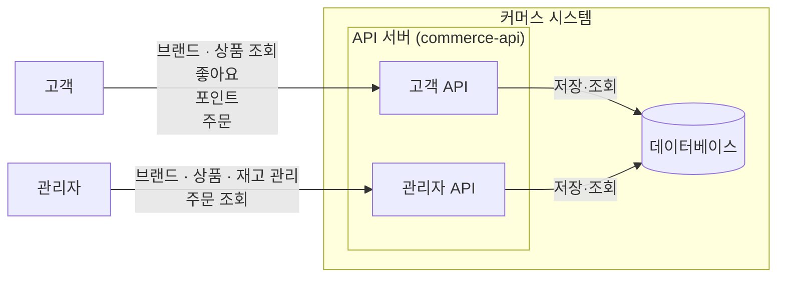

# 시스템 설계

## 1. 버드뷰

### 1.1 시스템 개요

이 시스템은 고객이 브랜드와 상품을 탐색하고, 관심 있는 상품에 좋아요를 표시하며, 포인트를 충전하고 상품을 주문할 수 있는 커머스 시스템이다.

관리자는 고객에게 노출되는 브랜드와 상품을 관리하고, 상품 재고를 변경하며 주문 현황을 조회한다.

고객과 관리자의 요청은 API 서버(`commerce-api`)가 처리하고, 데이터는 데이터베이스에 저장한다.

### 1.2 시스템 구성과 기능 범위



*그림 1. 고객·관리자와 커머스 시스템의 경계 및 요청 방향*

API 서버(`commerce-api`)는 고객용 API와 관리자용 API를 구분한다. 두 사용자는 브랜드와 상품처럼 같은 데이터를 다루기도 하지만, 허용하는 기능과 접근 가능한 데이터의 범위는 서로 다르다. 관리자가 변경한 브랜드·상품·재고 정보는 고객의 조회와 주문 처리에 사용된다.

각 역할이 실제로 수행하는 기능은 다음과 같다.

#### 고객

- 브랜드 상세 정보와 상품 목록·상세 정보를 조회한다.
- 상품에 좋아요를 등록·취소하고 자신의 좋아요 목록을 조회한다.
- 포인트를 충전하고 현재 잔액을 조회한다.
- 주문을 생성·확정하고 자신의 주문 목록과 상세 정보를 조회한다.

#### 관리자

- 브랜드를 등록·조회·수정·삭제한다.
- 상품을 등록·조회·수정·삭제한다.
- 상품 재고를 변경한다.
- 전체 주문 목록과 주문 상세 정보를 조회한다.

외부 결제·배송·알림과 같은 외부 서비스 연동은 이번 설계 범위에서 다루지 않는다.

개별 API 계약, 상세 도메인 관계, 처리 순서, 계층별 책임은 뒤의 설계에서 구체화한다.

## 2. 구조와 의존

### 2.1 적용 범위와 패키지 구조

`commerce-api`는 계층 우선(layer-first) 구조를 따른다. 최상위를 계층(`interfaces`, `application`, `domain`, `infrastructure`)으로 나누고, 각 계층 아래에 기능별 패키지를 구성한다.

```text
com.loopers
├── interfaces/api/{feature}
│   ├── {Feature}V1Controller
│   └── {Feature}AdminV1Controller  (관리자 API가 있는 경우)
├── application/{feature}
├── domain/{feature}
├── infrastructure/{feature}
└── support
```

고객용 API와 관리자용 API는 같은 기능 패키지에 배치하되, Controller와 요청·응답 모델을 분리한다.

layer-first는 HTTP 요청 처리, 유스케이스 조율, 도메인 규칙과 저장 구현을 책임의 종류에 따라 구분하고, 계층 간 의존 방향을 패키지 구조에 명확히 드러낼 수 있다.

feature-first는 한 기능과 관련된 코드를 가까운 위치에 모을 수 있다는 장점이 있다. 그러나 현재는 `Like`와 `Stock`을 독립 기능으로 볼지 다른 기능에 포함할지 등 기능 경계가 확정되지 않았으며, 주문 확정처럼 여러 기능 영역이 협력하는 유스케이스가 존재한다.

현재 시스템의 기능 경계와 프로젝트 규모를 고려해, 기능별 격리보다 계층별 책임과 의존 방향을 명확히 드러내는 layer-first 구조를 선택한다. 이 선택으로 하나의 기능을 변경할 때 여러 계층의 패키지를 오가야 하는 비용이 발생한다.

### 2.2 레이어별 역할

|계층|역할|
|---|---|
|interfaces|고객·관리자의 요청을 받아 응답으로 변환하고, 예외를 HTTP 오류로 매핑한다.|
|application|domain의 행동·저장 약속을 이용해 유스케이스를 조율한다. 여러 도메인을 함께 변경하는 유스케이스(예: 주문 확정)의 트랜잭션 경계를 가진다.|
|domain|상태와 업무 규칙을 표현하고, 필요한 저장소 인터페이스(약속)를 선언한다. 단일 도메인만 변경하는 유스케이스는 자체적으로 트랜잭션 경계를 가진다.|
|infrastructure|domain이 선언한 저장소 인터페이스를 JPA 등 구체 기술로 구현한다.|
|support|공통 오류 처리 등 애플리케이션 전반의 지원 코드를 제공한다. 모든 계층이 자유롭게 참조하는 완전히 독립적인 계층은 아니며, 하위 패키지의 역할에 따라 참조 범위가 정해진다.|

### 2.3 허용하는 의존 방향

```
interfaces → application → domain
infrastructure ─────────→ domain (구현)
```

- **domain**은 다른 어떤 계층에도 의존하지 않는다.
- **application**은 domain에만 의존한다. interfaces·infrastructure는 참조하지 않는다.
- **interfaces**는 application·domain에 의존할 수 있으나 infrastructure는 직접 참조하지 않는다.
- **infrastructure**는 domain이 선언한 인터페이스를 구현하기 위해 domain에 의존한다. application·interfaces에는 의존하지 않는다.
- **support**는 공통 오류 처리 등 지원 코드를 제공하며, 하위 패키지(예: error)의 역할에 따라 참조 범위가 정해진다. 모든 계층이 자유롭게 참조 가능한 독립 계층으로 간주하지 않는다.

### 2.4 Repository 추상화 위치

domain이 필요한 저장 행동을 인터페이스로 선언하고, infrastructure가 이를 구현한다(DIP). application은 인터페이스의 메서드 이름·입력·반환 타입만 알면 되고, 실제 구현이 JPA인지 테스트용 fake인지는 알 필요가 없다.

- 인터페이스는 `domain/{기능}`에 `{기능}Repository`로 선언한다.
- 구현체는 `infrastructure/{기능}`에 `{기능}RepositoryImpl`(도메인 인터페이스 구현)과 `{기능}JpaRepository`(Spring Data JPA)로 둔다.

```java
// domain/product
public interface ProductRepository {
    Optional<Product> find(long productId);
}

// infrastructure/product
// ProductRepositoryImpl이 ProductRepository를 구현하고, 내부에서 ProductJpaRepository(Spring Data JPA)에 위임한다.
// application/product: 유스케이스가 ProductRepository를 주입받아 사용
```

찾는 대상이 없을 때의 처리(예: NOT_FOUND)는 Repository가 아니라 호출자(domain service)가 판단한다. 테스트에서는 이 인터페이스에 DB 없이 값을 돌려주는 fake 구현을 연결해 application을 검증한다.

### 2.5 ArchUnit 검증 규칙

`ArchitectureTest.java`가 실제로 강제하는 규칙은 다음과 같다.

|규칙|검증 여부|
|---|---|
|domain은 interfaces·application·infrastructure에 의존하지 않는다|ArchUnit 검증됨|
|application은 interfaces·infrastructure에 의존하지 않는다|ArchUnit 검증됨|
|interfaces는 infrastructure에 의존하지 않는다|ArchUnit 검증됨|
|infrastructure는 application·interfaces에 의존하지 않는다|미검증 — 추가 필요|

## 3. 도메인 관계

## 4. 대표 흐름

## 5. API 계약과 주요 규칙

### 5.1 공통 규칙

- 주문 생성 시에는 포인트와 재고를 차감하지 않고, 주문 확정 시 차감한다.
- 삭제된 브랜드·상품은 고객 조회와 신규 주문에서 제외한다.

## 6. 설계 결정 요약
